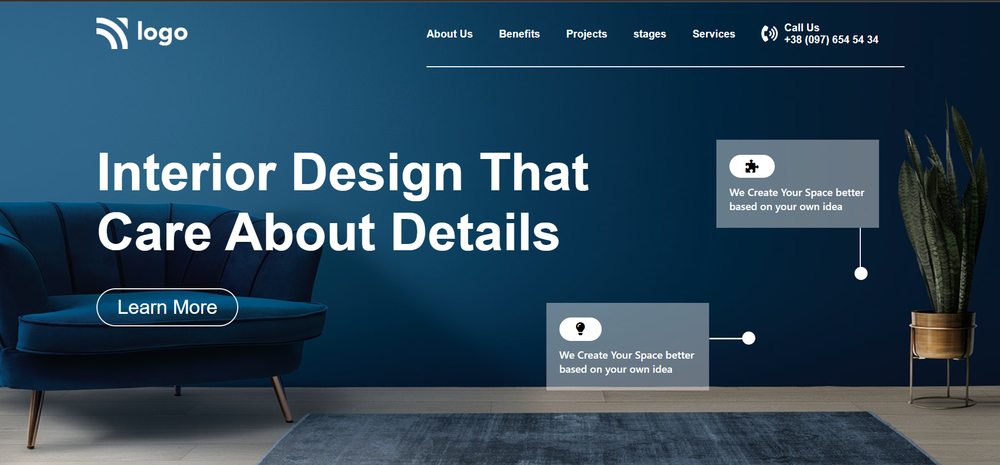
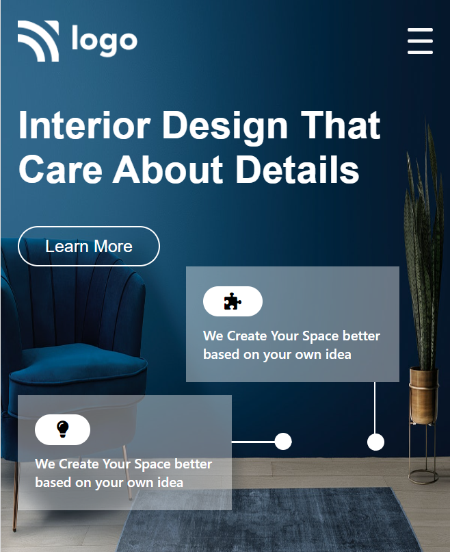

# Interior Design Landing Page 

 

 

> ## Output 

.gif)

  

##   

 ## 🚀 Project 10 Live Link 
 
- This Project is been Hosted on Netlify. [Project Live Link](https://interior-landing-page.netlify.app)

## 🛠 Skills Gained in this project

  This was the Landing page Template Design Given to convert it into ``HTML`` and ``CSS``.
 - Learnd to use css position  **[Relative & Absolute]** property.
- Learned to use pseudo classes like :nth-child(), :not(), :last-child, first-child
- Used Flex box Property
- Handled mobile Responsive With Media Queries

 ## ⌛ Time taken to finish this project 

 - Complete 2 hrs for web design and 30min for responsive